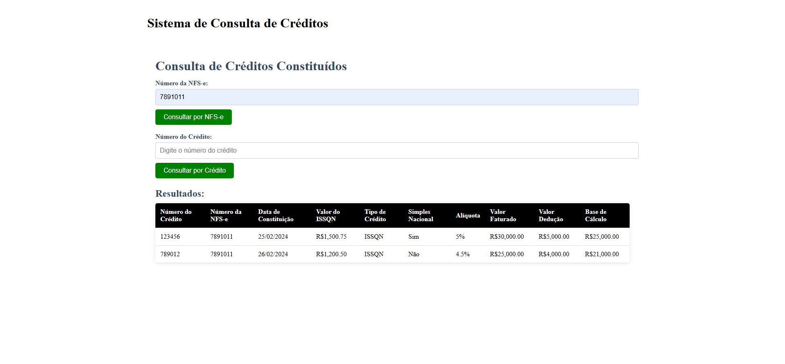

# API Consulta de Credito


## Tecnologias utilizadas
-Spring Boot <br/>
-Docker<br/>
-JUnit<br/>
-Mockito<br/>
-PostgreSQL<br/>

## Como testar 
Antes, configure a conexão com o banco de dados Postgresql no arquivo: application.properties

```bash
# Execute o seguinte comando na raiz do projeto: 
$ .\run.ps1

# Execute o seguinte comando tambem na raiz para testar no docker: 
$  docker-compose up --build
```


### No projeto o arquivo run.ps1 foi configurado para rodar os seguintes comando juntos: 
```bash
$ mvn clean package
$ mvn spring-boot:run
$ npm install
$ ng serve
```
### Portanto se der erro execute os comandos separadamente em cada pasta:


#### Testes Automatizado

```bash
$ mvn clean package
```
#### creditos-backend 
```bash
$ mvn spring-boot:run

# docker: 
$  docker-compose up --build
```
#### creditos-frontend
```bash
$ npm install
$ ng serve

# docker: 
$  docker-compose up --build
```
